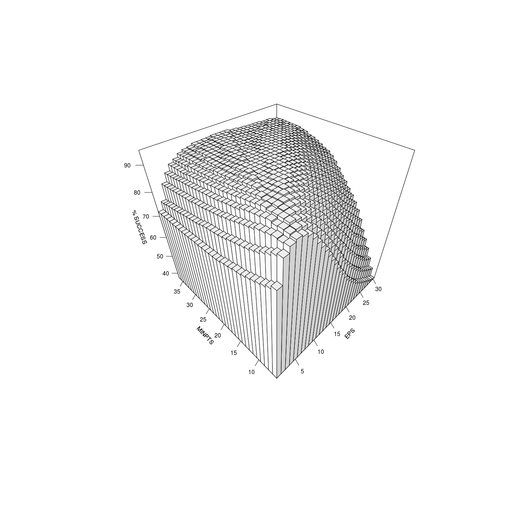

# Analyse de sensibilité de ST-DBSCAN pour un lot de trajectoires

## Inputs

### Lot de trajectoires

*"data/sample/trajectory_sample.csv"*

Un lot de trajectoires (n=15) testé sur QGIS pour la détection des pauses, dont les variables sont :

- idt = identifiant trajectoire 
- date
- x et y = latitude et longitude
- dt = timestamp (normalement 10 secondes) entre i-1 et i
- dist = distance parcourue entre i-1 et i
- v_exp = détection en pause (1/0) par utilisateur

### Paramètres

*"data/parameters.csv"*

Les paramètres à appliquer en utilisant ST-DBSCAN (fonction stdbscan.R), avec par ligne une combinaison de :

- eps [1,30]
- minpts [6,36]
- eps2 [100,1000]

## Méthode

- Application de ST-DBSCAN sur les 15 trajectoires, avec les combinaisons de paramètres = *st-dbscan_trajectories.R*
- Comparaison des résultats entre Vexp et Vstdbscan pour chaque combinaison de paramètres = *result_comparison.R*

## Outputs

### Résultats ST-DBSCAN
*"data/results_stdbscan/r_trajectories.csv"*

Dataframe comportant les 15 trajectoires, avec en première colonne l'identifiant de la trajectoire (idt) et les colonnes suivantes sont les combinaisons de paramètres.

### Résultats comparaison
*"data/results_comparison/r_comparison_points.csv"*

Dataframe comportant les combinaisons de paramètres, et le pourcentage de points correctement identifiés Vexp == Vstdbscan pour le lot de trajectoires.

### Visualisation résultat pour eps2 == 600

